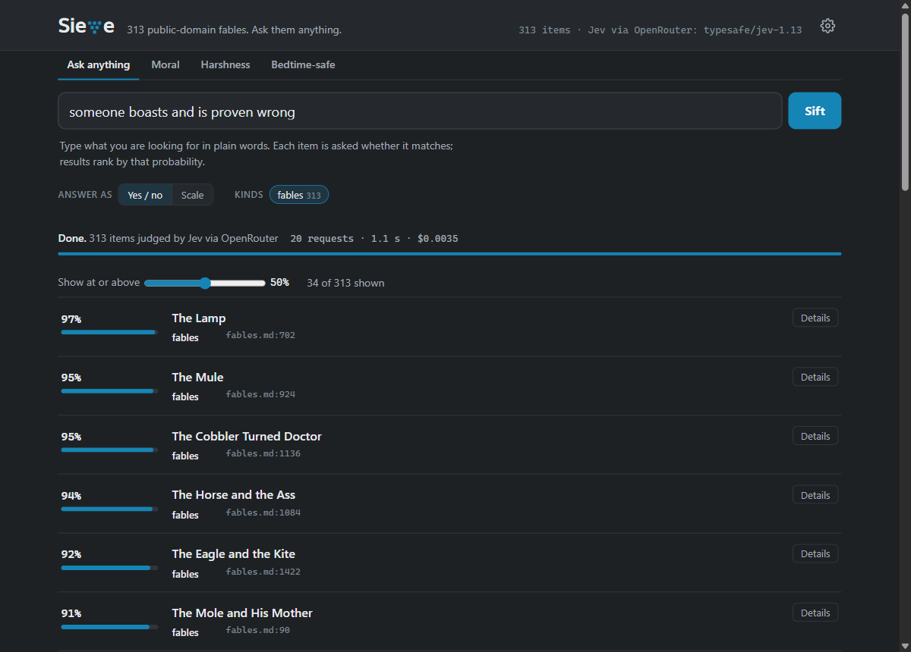
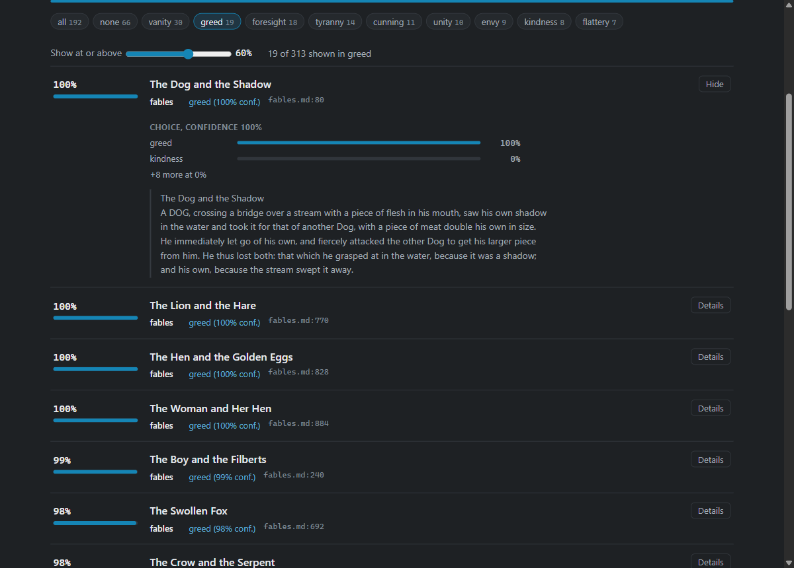

# Sieve

**Sift a whole folder of notes by any judgment, in seconds, for pennies.**

Point Sieve at a folder of Markdown (research notes, briefs, a blog, a knowledge base, 313 of Aesop's fables) and ask it anything in plain words: "security risks of AI agents", "a trick that backfires on the trickster", "a hands-on build I could demo at a meetup".
Every item gets the same typed question, [Jev](https://openrouter.ai/docs/guides/community/jev) answers each one with a calibrated probability, and Sieve ranks the whole corpus by the answer while you watch.



- **Fast enough to feel like search.** Items are packed 16 to a request and requests run 16 at a time. A 1,140-item research notebook comes back in 2-3 seconds, streaming.
- **Cheap enough to ask everything.** Jev bills input tokens only, at $0.042 per million. A full sweep of that notebook costs about 2.5 cents.
- **Calibrated, so it can say "not sure".** Every answer is a probability or a confidence, so Sieve ranks, thresholds, and hands you the uncertain middle instead of pretending.
- **Typed.** Answers are the options you defined, never a paragraph to parse.
- **Just Node.** Node 20.6+, no dependencies, no build step, no database. Your notes stay files.

## What is Jev?

Jev is TypeSafe's first "System One" model, available through [OpenRouter](https://openrouter.ai/typesafe/jev-1.13) as `typesafe/jev-1.13`.
It does not write text.
You send a *state* (any text or JSON) and *typed questions*, and it returns typed answers with probabilities in one parallel pass:

| Type | Question | Answer |
|---|---|---|
| `noul` | Yes or no? | the probability of yes |
| `choice` | Which of these options (up to 255)? | the pick, every option's probability, a confidence |
| `score` | Where on this ordered scale (2-10 levels)? | a position, per-level probabilities, a confidence |

That shape is exactly what "judge every item in a pile" needs: fast, cheap, and honest about uncertainty.
It is the wrong tool for anything that needs a sentence back.

## Quick start

```bash
git clone https://github.com/nothans/sieve && cd sieve
echo "OPENROUTER_API_KEY=sk-or-..." > .env      # any OpenRouter key; no TypeSafe account needed

# the web UI on the Aesop demo (localhost only)
node sieve.cjs serve --config examples/aesop/sieve.config.json
# open http://127.0.0.1:4177

# or the command line
node sieve.cjs ask "a clever animal outwits a stronger one" --config examples/aesop/sieve.config.json
node sieve.cjs lens moral --config examples/aesop/sieve.config.json
```

Two demos ship in `examples/`:
- **`aesop/`**: 313 public-domain fables (Project Gutenberg #21), with lenses for the moral, how harsh the ending is, and whether it is bedtime-safe.
- **`research-notes/`**: a small synthetic research notebook (briefs, news digests, insight logs), with a routing report and an accuracy eval. All of it is invented sample data.



## Commands

```bash
node sieve.cjs index                         # count items by kind
node sieve.cjs ask "<plain words>"           # rank everything; --type score for a 4-step scale
node sieve.cjs lens <preset>                 # run a preset from the config
node sieve.cjs route                         # write a routing report (orphans, hooks, second looks)
node sieve.cjs eval                          # accuracy of a choice lens against labels you already have
node sieve.cjs eval --backend local          # the same eval against a local model (see Backends)
node sieve.cjs serve                         # the web UI
```

Common options: `--config <file>`, `--kind a,b`, `--since 2026-06`, `--top 20`, `--json`, `--pack <n>`, `--no-cache`.
`node sieve.cjs --help` lists them all.
Answers are cached in `.cache/answers.jsonl`, so re-running an unchanged sift is free.

## Point it at your own notes

Copy an example config into `local/` (git ignores everything there but its README) and edit it:

```bash
cp examples/research-notes/sieve.config.json local/sieve.config.json
node sieve.cjs index        # local/sieve.config.json is the default config
```

A config has five parts.
Paths are relative to the config file.

### `sources`: what counts as an item

```json
{ "root": "../../my-notes",
  "sources": [
    { "kind": "brief",   "display": "briefs",   "glob": "briefs/*.md", "exclude": ["_*", "README.md"],
      "text": "gist", "gist": ["tl;?dr", "implications"], "dateFrom": ["field", "filename"] },
    { "kind": "news",    "glob": "news/*.md", "split": { "heading": 3, "requireBody": true }, "maxChars": 1600 },
    { "kind": "insight", "glob": "insights/*.md", "split": { "heading": 2, "requireDate": true, "stripDate": true },
      "dateFrom": ["title"], "label": "filename" },
    { "kind": "signal",  "glob": "trends/*.md", "split": "dated-bullets", "counterKind": "counter-signal" },
    { "kind": "post",    "glob": "blog/*/*.md", "sameNameAsFolder": true, "text": "body" },
    { "kind": "talk",    "glob": "talks/*/*.md", "firstOf": ["abstract.md", "README.md"], "text": "full" }
  ] }
```

| Option | Meaning |
|---|---|
| `glob` | One pattern or a list. `*` and `?` match within a folder, `**` across folders. |
| `exclude` | Patterns to skip. One without a slash matches the file name. |
| `split` | `"file"` (default): one item per file. `{"heading": n}`: one per level-n section (`requireBody`, `requireDate`, `stripDate`). `"dated-bullets"`: one per `- **YYYY-MM-DD - Title.** ...` line; a heading containing "counter" switches to `counterKind`. |
| `text` | For whole files: `"gist"` (default: only the sections whose titles match `gist`, else the file), `"body"` (after front matter), or `"full"`. |
| `maxChars` | Clip each item's text (default 2,400). Jev's accuracy drops when the state is full of text the question does not need. |
| `dateFrom` | Where to find the date, in order: `frontmatter`, `field` (a `**Date:**` line), `title` (the section heading), `filename`, `folder`, `head:N` (the first N characters). Undated items fall back to the commit that added the file unless `"gitDates": false`. |
| `titleFallback` | When there is no front matter title or `#` heading: `filename`, `folder`, `titlecase-folder`, or the default title-cased file name. |
| `label` | `"filename"` or `"folder"`: attach a label to each item, for `eval` and second looks. |
| `sameNameAsFolder`, `firstOf` | Keep only `x/x.md`; or keep the first of these names in each folder. |
| `display` | The plural shown in the UI. |

### `lenses`: the questions

```json
"lenses": {
  "theme":  { "type": "choice", "label": "Theme", "question": "Which theme is {item} mainly about?",
              "options": { "edge-ai": "Running models on small local hardware...", "none": "None of these themes." } },
  "demo":   { "type": "noul", "label": "Live-demo ready", "question": "Does {item} describe a working build that could be demonstrated live?",
              "true": "A concrete, runnable thing.", "false": "Analysis, opinion, or news without something to show." },
  "strength": { "type": "score", "label": "Evidence", "question": "How well does {item} support its main claim?",
              "levels": ["No evidence.", "An anecdote.", "One measured result.", "Several agreeing sources."] }
}
```

`{item}` becomes "this item" or a pointer into a packed request.
The option descriptions are the whole prompt, so write them carefully (see "How to ask Jev" below).
Give a choice a `none` option so it is never forced to pick.

### `presets`: what the UI and `lens` offer

```json
"presets": [
  { "id": "ask" },
  { "id": "theme", "lens": "theme", "group": true },
  { "id": "counter", "lens": "counter", "thesis": "the default claim to test" },
  { "id": "fit", "title": "Fits the book", "lenses": { "a": "angleA", "b": "angleB", "ch": "chapter" },
    "value": { "max": ["a", "b"] }, "label": { "choice": "ch", "via": { "a": "angle A", "b": "angle B" } }, "group": "ch" }
]
```

- `ask` is built in: the free-text box.
- A single-`lens` preset ranks by that lens. `group` adds filter chips by choice. `thesis` adds a text box that tests a typed claim instead of the lens.
- A composite preset asks several lenses in the same request and ranks by the strongest (`value.max`). This is how to turn an interpretive question ("does this fit my book?") into literal ones Jev answers well.
- `examples`, `name`, and `tagline` at the top level fill in the UI.

### `route`: the routing report

```json
"route": {
  "lenses": { "theme": "theme" }, "category": "theme", "confident": 0.8,
  "orphans": { "kinds": ["brief"], "linkFiles": ["index.md", "insights/*.md"] },
  "hooks": { "title": "Book hooks", "angles": { "a": "angle A" }, "choice": "ch", "min": 0.6, "notLinkedIn": ["book/signals.md"] },
  "secondLooks": { "kinds": ["insight"], "min": 0.9 },
  "reportsDir": "reports"
}
```

`sieve route` writes a Markdown report with up to three sections:
**orphans** (items that none of the `linkFiles` mention yet, grouped by the category Jev picks);
**hooks** (items that clear a composite bar and are not yet in `notLinkedIn`);
**second looks** (labeled items Jev is at least `min` sure belong to a different category, which usually means misfiled or cross-cutting).
The research-notes demo finds exactly the four briefs its index leaves out.

### `eval`: is it any good on your notes?

```json
"eval": { "lens": "theme", "kinds": ["insight"], "strip": ["^\\*\\*Tags:\\*\\*.*$"], "n": 240 }
```

If a source carries labels (`"label": "filename"` when files are already sorted by topic), that filing is ground truth.
`sieve eval` strips anything that would give the answer away (`strip`, regexes), asks the lens, and reports accuracy, top-2 accuracy, accuracy by confidence band, and the most common confusions, at several pack sizes.

## Backends: Jev in the cloud, or a model on your machine

Every backend speaks the same request (`{ model, state, questions }` in, typed answers out), so Sieve can send its questions to:

| Backend | What it is | Defaults |
|---|---|---|
| **Jev via OpenRouter** (default) | `typesafe/jev-1.13`; key in `OPENROUTER_API_KEY` | 16 items per request, 16 requests at once |
| **Jev via TypeSafe** | `jev-latest` direct; key in `TYPESAFE_API_KEY` | 16 and 16 |
| **Local server** | any server with TypeSafe's `/v1/systemone` API: [Kev](https://github.com/jaredpalmer/kev), [Laya](https://github.com/NandhaKishorM/laya), [openjev](https://github.com/razorback16/openjev), JevK5 | 1 item per request, 1 at a time, 5-minute timeout |

Pick one in the web UI's **Settings** tab (or `--backend <id>` on the command line), edit its URL, model, and limits, add more local servers, and **Test connection** before you save.
Settings live in `local/settings.json`.
Keys never do: a profile names the environment variable that holds its key, and the page only shows whether it is set.
Plain `http` is allowed only for this machine.
Answers are cached per backend (and per checkpoint a local server reports), so switching backends never mixes their answers.

Running Kev locally (it needs about 9 GB of RAM or VRAM for Kev-4B in bf16; see its README for Macs and GPUs):

```bash
git clone https://github.com/jaredpalmer/kev && cd kev && uv sync --extra serve
KEV_DTYPE=bf16 uv run --extra serve python -m kev.serve --run jaredpalmer/kev-4b --port 8009
# then in Sieve: Settings > Local server > Test connection, or
node sieve.cjs eval --backend local --packs 1 --concurrency 3
```

**What to expect (measured 2026-09-25, same 240 hand-filed items as above, one item per request):**

| | Kev-4B, local CPU (Ryzen AI 9 HX 370, bf16) | Jev 1.13 via OpenRouter |
|---|---|---|
| Accuracy | 55.0% | 77.9% (same items) |
| Best real theme, with the "none" option removed | 75.8% | 81.8% |
| Right answer in the top two | 79.6% | 94.4% |
| To be right 90% of the time, act at | confidence ≥ 0.52, covering 25% of items | ≥ 0.91, covering 58% |
| Speed | about 5-7 s per item (11 items a minute at 3 requests at once) | about 0.3-0.8 s per request of 16 items |
| Cost | electricity | about $0.01 for all 240 |

Most of Kev's gap is one habit: it picked "none of these themes" on 83 of 240 items (Jev: 17).
It is also underconfident here (answers it rated 0.5-0.8 were right 86% of the time), which is why its 90% threshold sits at 0.52.
Your numbers will differ by corpus and hardware, so run `sieve eval --backend <id>` before trusting a local backend: it reports accuracy, accuracy without the escape option, and the threshold that reaches 90% and 95% on your own labels.
Thresholds do not transfer between backends.

## How well does it work? (measured)

On a real 1,140-item research notebook (the author's own; not included), against 240 insights and signals already filed into six themes by hand, with the tags stripped:

| Items per request | Accuracy | Top-2 | When Jev's confidence is 0.8+ | Requests | Cost | Time |
|---|---|---|---|---|---|---|
| 1 | 77.5% | 93.3% | 88.5% (69% of items) | 240 | $0.0106 | 5.9 s |
| 8 | 80.0-80.4% | 93.3-93.8% | 88.8-89.3% | 30 | $0.0084 | 0.9-1.8 s |
| **16 (default)** | 81.7-82.1% | 94.2-95.4% | 92.5-93.5% (64-66% of items) | 15 | $0.0083 | 0.9-1.4 s |
| 26 | 84.2-85.0% | 95.8% | 92.5-92.6% | 10 | $0.0082 | 1.0-1.5 s |

Two runs; below 0.5 confidence, accuracy was close to a coin flip, and Jev said so.
Packing did not cost accuracy here, and may have helped, but the eval interleaves themes, so a folder sorted by topic could behave differently: run `eval` on yours.
On the synthetic research-notes demo the theme lens scores 95% (19 of 20, and the miss is a deliberately cross-cutting entry).

## How to ask Jev

Most of the work is wording the questions so a literal reader gets them right.
TypeSafe documents these failure modes in its [jev-1.13 jaggedness notes](https://docs.typesafe.ai/model-jaggedness/jev-1.13.md); here is how each one showed up in practice.
- **Interpretive questions over-fire.** "Which chapter of my book does this feed?" put 76 of 612 items in the chapter about trust, because "trust" reads broadly. Three literal yes/no questions, the max taken in code, then the chapter choice: 15 precise hits. That is the composite preset above.
- **Indirection turns to mush.** "Is this evidence against thesis X?" left every item near 0.45. Asking for the concrete thing that would contradict X put the one real counter-argument on top and dropped the rest near zero.
- **Pronouns mean nothing.** "Projects I could demo" ranked a product launch first; Jev does not know who "I" is. "A hands-on build that could be demoed live at a developer meetup" ranked the right talk first.
- **Keep arithmetic, counting, and dates in code.** Filter by kind and date before asking; Jev never sees what it does not need to judge.
- **It cannot explain itself.** Every result opens to show the probabilities and exactly the text Jev read, so you can judge the judgment.
- **Adversarial text can move it.** Content is data to Jev, not something it defends against. Test before gating anything that matters.

## The Jev client

`lib/jev.cjs` is a standalone, dependency-free client and CLI for Jev on OpenRouter, usable without the rest of Sieve:

```bash
node lib/jev.cjs noul "Is the writer frustrated?" --state "The build is red again. Third time today."
node lib/jev.cjs choice "Which team owns this?" billing="Payments, refunds" tech="Bugs, outages" --state-file ticket.txt
node lib/jev.cjs score "How risky is this?" "No risk" "Some risk" "High risk" --state -
node lib/jev.cjs batch --in items.jsonl --questions questions.json --out answers.jsonl
```

```js
const { createClient, noul, choice, gate } = require('./lib/jev.cjs');
const jev = createClient({ cacheFile: '.cache/answers.jsonl' });
const r = await jev.decide(ticketText, { refund: noul('Does the customer ask for a refund?') });
gate(r.answers.refund.noul);   // 'approve' at 0.9+, 'block' at 0.1-, else 'review'
```

It validates questions against the documented limits before spending anything, retries 429s and gateway errors with backoff (never a 400), caches answers on disk, runs batches with bounded concurrency, and keeps a running tally of cost and latency.
Set `JEV_MODEL` to `~typesafe/jev-latest` to follow new releases; the default pins `typesafe/jev-1.13` so tuned thresholds do not drift.

## Safety notes

- `sieve serve` binds to 127.0.0.1 only. Every sift spends API credit and the server holds your keys, so it is not for the network.
- Binding to localhost is not enough on its own, because any web page you have open can send requests to 127.0.0.1. Sieve's API answers only its own page: it checks the Host header (which stops DNS rebinding), the Origin, and `Sec-Fetch-Site`, and settings changes also require an `X-Sieve` header that a cross-site page cannot send.
- One sift runs at a time, the page validates with a free preflight, and it never lets the browser silently reconnect a stream (a reconnect would be a second, paid sift).
- Jev has a 64k-token request limit (32k for the state plus the longest question) and 1,200 requests per minute. Sieve's packing keeps a 1,000-item sweep to about 70 requests.

## Tests

```bash
npm test        # or: node --test "test/*.test.cjs"
```

32 tests, no network: the corpus reader on every source mode, config loading, lenses and presets, backend profiles and settings, packing at sizes 1-99, the report and eval logic (thresholds and the escape-option check), both shipped examples, the Jev client's retries and cache, and the web server end to end against a fake backend, including the cross-site guard.

## Credits

Built by [Hans Scharler](https://nothans.com).
Jev is TypeSafe's model ([docs](https://docs.typesafe.ai/llms.txt)), served here through OpenRouter; Sieve is not affiliated with either.
The Aesop demo is George Fyler Townsend's 1867 translation from [Project Gutenberg eBook #21](https://www.gutenberg.org/ebooks/21), public domain in the US.

MIT License.
