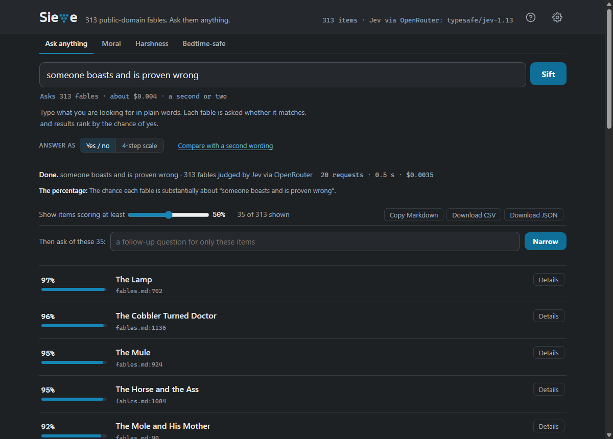
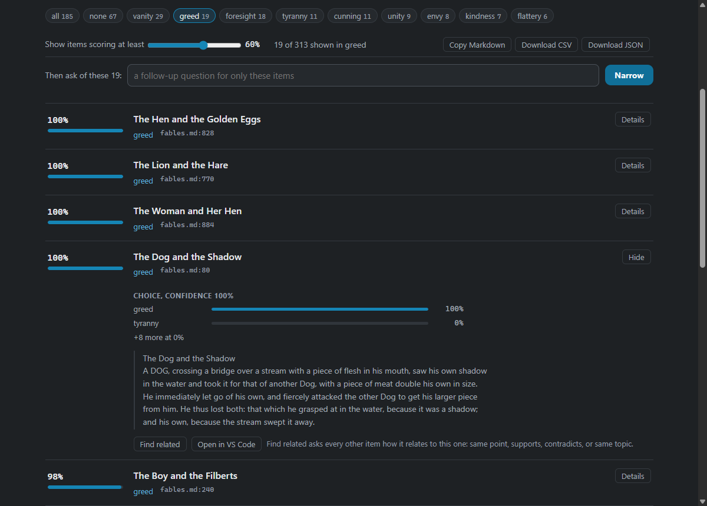
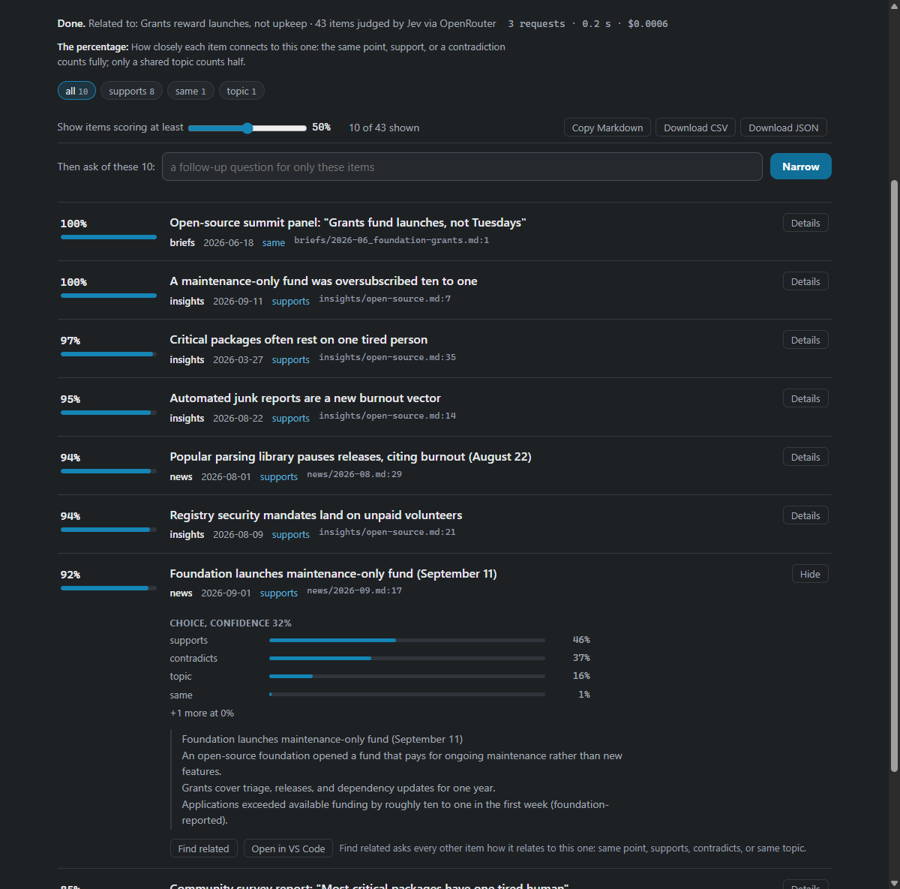
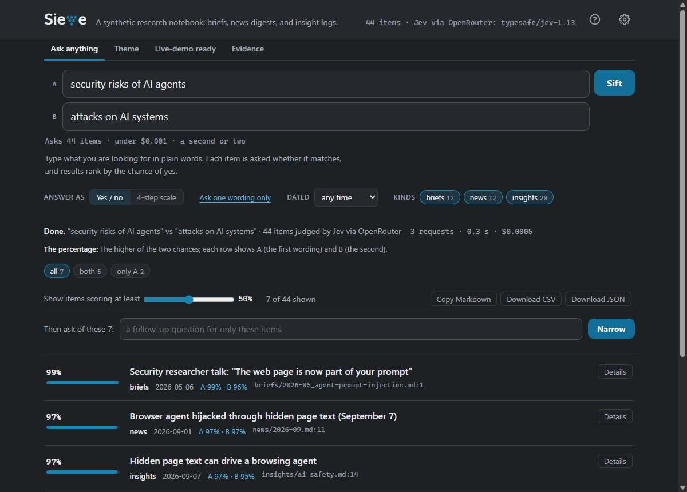

# Sieve

**Find where a folder of notes contradicts itself, and ask it anything.**

Point Sieve at a folder of Markdown: research notes, briefs, a blog, a knowledge base.
`crosscheck` compares every note with every other note and lists the pairs that contradict each other and the pairs that make the same point twice.
`ask` puts one plain-English question to every note and ranks the folder by the answer.
[Jev](https://openrouter.ai/docs/guides/community/jev) answers every question with a typed answer and a probability, and never writes text.
There is no index to build and nothing to embed.

```text
$ node sieve.cjs crosscheck --config examples/research-notes/crosscheck.config.json
60 items, 1,770 pairs, each judged from both sides: 0 judgments remembered, 3,540 to ask in 240 requests, about $0.05
contradicts 100%  2026-09-23  field-notes/2026-09.md:15  Four-bit models kept their calibration
            99/100 2026-08-14  insights/edge-ai.md:21  Quantization quietly breaks confidence scores
...
same        100%  2026-09-11  insights/open-source.md:7  A maintenance-only fund was oversubscribed ten to one
            99/100 2026-09-01  news/2026-09.md:17  Foundation launches maintenance-only fund (September 11)
...
30 contradictions, 3 to review, 17 pairs making the same point

60 items, 240 requests (0 cached, 0 retries, 0 failed), $0.0486, 4.6 s, p50 212 ms
```

Features:

- **Crosscheck.** Every pair of notes judged from both sides, reported as contradictions, repeats, and notes at odds with several others. A contradiction between an old note and a new one often means the old note is stale.
- **Ask.** One plain-English question put to every note, ranked by probability. A 1,140-item notebook comes back in 2-3 seconds for about 2.5 cents.
- **Related, compare, narrow.** How every note relates to one note, two wordings of a question side by side, and a follow-up asked of only the matches.
- **Lint.** Plain-English rules with an exit code, for CI.
- **Route and eval.** A report of orphans and misfiled notes, and accuracy measured against labels you already have.
- **Probabilities.** Every answer comes with one, so Sieve ranks, thresholds, and hands you the uncertain middle.
- **Cost estimate and budget.** Every run is estimated before it spends anything, and crosscheck stops at a budget.
- **Cloud or local.** Jev through OpenRouter, or a compatible model on your own machine.
- **Just Node.** Node 20.6+, no dependencies, no build step, no database. Your notes stay files.



Resources:

- Quick start: [clone, add a key, run](#quick-start)
- Crosscheck: [what it found and what it missed](#crosscheck-every-note-against-every-other)
- Using your own notes: [the config](#point-it-at-your-own-notes)
- Wording questions: [How to ask Jev](#how-to-ask-jev)
- Accuracy against hand-filed labels: [How well does it work?](#how-well-does-it-work-measured)
- Blog post on Jev: [My Name is Jev: Meet the New Type of AI Model](https://nothans.com/my-name-is-jev-meet-the-new-type-of-ai-model)
- Jev on OpenRouter: [the guide](https://openrouter.ai/docs/guides/community/jev)

## What is Jev?

Jev is TypeSafe's first "System One" model, available through [OpenRouter](https://openrouter.ai/typesafe/jev-1.13) as `typesafe/jev-1.13`.
It does not write text.
You send a *state* (any text or JSON) and *typed questions*, and it returns typed answers with probabilities in one parallel pass:

| Type | Question | Answer |
|---|---|---|
| `noul` | Yes or no? | the probability of yes |
| `choice` | Which of these options (up to 255)? | the pick, every option's probability, a confidence |
| `score` | Where on this ordered scale (2-10 levels)? | a position, per-level probabilities, a confidence |

That shape is exactly what "judge every item in a pile" needs: fast, cheap, and honest about uncertainty.
It is the wrong tool for anything that needs a sentence back.

## Quick start

```bash
git clone https://github.com/nothans/sieve && cd sieve
echo "OPENROUTER_API_KEY=sk-or-..." > .env      # any OpenRouter key; no TypeSafe account needed

# the web UI on the Aesop demo (localhost only)
node sieve.cjs serve --config examples/aesop/sieve.config.json
# open http://127.0.0.1:4177

# or the command line
node sieve.cjs crosscheck --config examples/research-notes/crosscheck.config.json    # about 5 cents
node sieve.cjs ask "a clever animal outwits a stronger one" --config examples/aesop/sieve.config.json
node sieve.cjs lens moral --config examples/aesop/sieve.config.json
```

### Using the web UI

The page is built to explain itself as you go:
- **Before you sift**, the line under the question box says how many items will be asked, roughly what it will cost, and how long it will take (on a local model, once the first sift has timed it). Each preset tab shows the exact question it asks and the options or scale it picks from.
- **While it runs**, results arrive best first, with a progress bar and a time left.
- **After**, a line above the list says what the percentage means for that question, the slider sets how high an item must score to show, and clicking a title opens what the model read and why it scored that way.
- **When nothing clears the bar**, the page says what came closest and offers to show it, or to try a second wording side by side.
- **Without an API key**, the page lists the setup steps instead of failing on every item.
- **Press `?`** (or the help icon) for a guide written from your own config: your tabs, your examples, your backend's cost and privacy. `/` jumps to the question box.

Two demos ship in `examples/`:
- **`aesop/`**: 313 public-domain fables (Project Gutenberg #21), with lenses for the moral, how harsh the ending is, and whether it is bedtime-safe.
- **`research-notes/`**: a small synthetic research notebook (briefs, news digests, insight logs), with a routing report and an accuracy eval. A second config, `crosscheck.config.json`, adds sixteen field notes that disagree with the notebook. All of it is invented sample data.



## Commands

```bash
node sieve.cjs index                         # count items by kind
node sieve.cjs crosscheck                    # every note against every other: contradictions, repeats
node sieve.cjs ask "<plain words>"           # rank everything; --type score for a 4-step scale
node sieve.cjs ask "<A>" --vs "<B>"          # compare two wordings of the same question
node sieve.cjs ask "<A>" --then "<B>"        # ask B of only the items A matched (--min 0.5)
node sieve.cjs lens <preset>                 # run a preset from the config
node sieve.cjs related "<title words>"       # how every other item relates to one item
node sieve.cjs lint                          # check plain-English rules; exits 1 on a fail
node sieve.cjs route                         # write a routing report (orphans, hooks, second looks)
node sieve.cjs eval                          # accuracy of a choice lens against labels you already have
node sieve.cjs eval --backend local          # the same eval against a local model (see Backends)
node sieve.cjs serve                         # the web UI
```

Common options: `--config <file>`, `--kind a,b`, `--since 2026-06`, `--top 20`, `--json`, `--pack <n>`, `--no-cache`.
`node sieve.cjs --help` lists them all.
Answers are cached in `.cache/answers.jsonl`, so re-running an unchanged sift is free.
Crosscheck keeps its own record in `.cache/pairs.jsonl`.

## Crosscheck: every note against every other

`sieve crosscheck` asks one question of every pair of notes: how does this note relate to that one?
The answer is one of five: it makes the *same* point, *supports* it, *contradicts* it, shares only the *topic*, or is *unrelated*.
It reports three things: pairs that contradict each other, pairs that make the same point twice, and notes that disagree with several others.
Each note takes a turn as the anchor, so every pair is judged twice, once from each side, and a pair is listed on the average of the two.
There is no index to build and nothing to embed.

```text
$ node sieve.cjs crosscheck --config examples/research-notes/crosscheck.config.json
60 items, 1,770 pairs, each judged from both sides: 0 judgments remembered, 3,540 to ask in 240 requests, about $0.05
contradicts 100%  2026-09-23  field-notes/2026-09.md:15  Four-bit models kept their calibration
            99/100 2026-08-14  insights/edge-ai.md:21  Quantization quietly breaks confidence scores
contradicts  99%  2026-09-16  field-notes/2026-09.md:50  The network did the work in a keyword spotter
            98/99 2026-03-12  insights/edge-ai.md:35  Wake-word models live or die on the audio front end
...
same        100%  2026-09-11  insights/open-source.md:7  A maintenance-only fund was oversubscribed ten to one
            99/100 2026-09-01  news/2026-09.md:17  Foundation launches maintenance-only fund (September 11)
...
30 contradictions, 3 to review, 17 pairs making the same point
wrote examples/research-notes/reports/crosscheck-2026-09-27.md

60 items, 240 requests (0 cached, 0 retries, 0 failed), $0.0486, 4.6 s, p50 212 ms
```

When the dates of a pair differ, the newer note is printed first, with the average beside it and the two sides under it.
The full list goes to a Markdown report with links to each file and line.
A run narrowed with `--kind`, `--since`, or `--changed` writes its own report, so it never replaces the full one from the same day.

What each section is for:
- **Contradictions.** One of the two notes is wrong, or the facts moved on and the older note is stale, or the newer note is a dissent worth keeping in sight.
- **The same point, twice.** A note and the source it came from, or a duplicate. Link them or merge them.
- **Notes that disagree with several others.** One note against many is the outlier in the folder, for better or worse.
- **Worth a second look.** Pairs that average between 35% and 50%: mild tensions, mixed with one side misreading the other.

**Why both sides.**
One side alone is noisy.
On a real notebook, 72 pairs had one side at 50% or more, and 16 had an average of 50% or more.
The pairs that dropped out were mostly one note read as contradicting everything near it, such as a chip-funding story set against six model releases.

**Measured on the demo (2026-09-27, Jev 1.13 via OpenRouter).**
The crosscheck demo is the sample notebook plus sixteen field notes.
Ten were written to disagree with one insight each, some without a single negating word.
Six are decoys: notes that agree with an insight in negative wording, or share its topic and make another point.
- Of the 10 intended pairs, 9 were listed. The tenth note was listed against two other notes that make the claim more directly.
- 30 pairs were listed in all, because most insights have a brief or a news story behind them and the field note contradicts those too. Read one by one, 27 are real disagreements, 2 are debatable, and 1 is wrong.
- No decoy was listed against the note it agrees with.
- Without the field notes, the same notebook has 946 pairs and no contradiction at 50% from either side.
- The 17 "same point" pairs are 16 insights matched to the brief or news story they came from, and one decoy that restates an insight.

**Measured on a real notebook (the author's own; not included).**
152 notes in six themes, compared within each theme: 3,890 pairs, 13 seconds, $0.20.
Two of those notes had been filed by hand as counter-arguments.
Ranked by how many contradictions each note was part of, they came first and third of 152.
Of the 16 pairs listed, 15 involved one of those two notes.
The other was a note saying a release had not appeared yet and a later note saying it had shipped.

**What it costs.**
Pairs grow with the square of the notebook, so crosscheck says what a run will cost before it spends anything, and does not start if that is over the budget (`--budget`, $1 unless the config says otherwise).
The estimate is a guess at the bill, so the bill is watched too: a run stops when what it has been charged reaches the budget, keeps what it has judged, and exits with 1.
`--dry-run` prints the plan and stops.

| Notebook | Pairs | Estimate |
|---|---|---|
| 60 notes (the demo) | 1,770 | $0.05 |
| 313 fables | 48,828 | $1.62 |
| 687 notes, compared within 10 themes | 53,171 | $3.11 |
| 1,222 notes, every pair | 746,031 | $44.74 |

The estimate ran 3% and 9% above the real bill on the two runs measured.
To keep a large notebook in hand, compare inside each label or kind (`--within label`), or narrow with `--kind` and `--since`.

**It remembers.**
Every judgment is stored in `.cache/pairs.jsonl` under the text of both notes and the wording of the question.
A second run asks nothing.
Adding one note to the 60-note demo asked 120 judgments in 64 requests: 1.4 seconds and a quarter of a cent.
Editing a note forgets its pairs; moving it to another file does not.
Two notes with the same words are asked about once.
Each backend keeps its own memory.
Delete the file to forget everything.

**In a pull request.**
`--changed` keeps only the pairs that touch a changed note, which answers "does this new note contradict anything already here?".
A note counts as changed when its title or text was not in the file at that ref, so a section added to a long file is checked and the sections already in it are not.

```yaml
# .github/workflows/crosscheck.yml
on: pull_request
jobs:
  crosscheck:
    runs-on: ubuntu-latest
    steps:
      - uses: actions/checkout@v4
        with: { fetch-depth: 0 }
      - uses: actions/setup-node@v4
        with: { node-version: 22 }
      - run: git clone --depth 1 https://github.com/nothans/sieve /tmp/sieve
      - run: node /tmp/sieve/sieve.cjs crosscheck --config sieve.config.json --changed origin/${{ github.base_ref }} --format github
        env: { OPENROUTER_API_KEY: "${{ secrets.OPENROUTER_API_KEY }}" }
```

A contradiction is annotated on the changed note as a warning, and a second look as a notice.
Add `--strict` to make a contradiction an error and exit with 1.

**Where it falls short.**
- It finds notes that state opposing things. A contradiction that is only implied, or that takes arithmetic to see, can pass unlisted.
- A note that qualifies another ("true for flagship projects, not for the long tail") is not a contradiction, and was not listed as one in the demo, but the line between the two is a judgment.
- Answers move a few points between runs, so a pair near 50% can be listed in one run and sit in "second look" in the next.
- It is built for notes that make claims or report events.
- Text that leaves the machine is the same as for any other command: every note compared is sent to the backend.

## More than search

A typed question with a probability is a building block, not only a search box.
Related, compare, and narrow work in the web UI and on the command line; lint is a command for CI; export is in the web UI.

### Related: "more like this", as a stance

Open any result's **Details** and press **Find related**.
Every other item is asked how it relates to that one: it makes the *same* point, *supports* it with its own evidence, *contradicts* it, shares only the *topic*, or is *unrelated*.
The anchor item rides along in every request, so there is no embedding index to build or keep fresh, and the answer is a relation you can act on rather than a distance.



On the research-notes demo it finds the brief behind an insight at 94% "same", and the evidence around it as "supports".
Mixed cases come back mixed: a news story about a new maintenance-only fund comes back about half *supports* and a third *contradicts* (the split moves a few points between runs), because a fund for upkeep cuts against "nobody funds upkeep" while being ten times oversubscribed backs it up.
On six invented pairs written to test it (two contradictions, one of each other relation, and an unrelated one), Jev picked the intended relation every time.
It is built for notes that make claims or report events; on fables, where the point is a moral, most items land on "same topic".
It runs on a local backend too; Kev-4B put the closest item first but called most of the rest "unrelated", the same habit as its "none" answers.

```bash
node sieve.cjs related "grants reward" --config examples/research-notes/sieve.config.json
```

### Compare two wordings

Most of the work in Sieve is wording the question (see "How to ask Jev" below), so test two wordings side by side.
Both are asked in the same request, which reads each item once, so the second wording costs almost nothing ($0.0005 against $0.0004 for the demo).
Results are grouped into *both*, *only A*, *only B*, and *neither*.



"Security risks of AI agents" and "attacks on AI systems" agree on five items and part ways on two: credential sprawl and tool permissions are risks, not attacks, and Jev reads the wording literally.

### Narrow, one question at a time

After a sift, **Then ask of these** puts a follow-up question to only the items above the bar (and inside the group chip you picked).
Each step is a breadcrumb you can click to go back, so a search can be built up like a funnel and every step shows what it kept and what it dropped.
On the demo, "small hardware that runs AI models on its own" keeps 9 of 44 items; "something shown working at an event" then puts the maker-conference story and the two live-demo notes on top at 95-97% and drops the chip announcements below 10%.
The follow-up only reads the 9 survivors, so it costs a fraction of the first question.

```bash
node sieve.cjs ask "small hardware that runs AI models on its own" --then "something shown working at an event"
```

### Lint: plain-English rules, with an exit code

A lint rule is a yes/no lens where *yes* means a problem.
`sieve lint` asks every rule of every item it covers (all rules for an item in one request) and sorts the answers into **fail**, **review**, and pass by the rule's thresholds, so the uncertain middle goes to a person instead of being guessed.
It exits with 1 when anything fails, which makes it a check for CI or a pre-publish step.
A backend error also exits with 1: a check that could not ask about a note never counts as passing it.

```json
"lint": { "rules": [
  { "id": "unsourced-figure", "lens": "unsourced", "kinds": ["brief", "insight"], "fail": 0.9, "warn": 0.6 }
] }
```

```text
$ node sieve.cjs lint --config examples/research-notes/sieve.config.json
fail   96%  unsourced-figure  insights/edge-ai.md:35  Wake-word models live or die on the audio front end
fail   92%  unsourced-figure  insights/edge-ai.md:28  Misclassifications are the best part of a live vision demo
warn   87%  unsourced-figure  insights/ai-safety.md:28  Leaderboard gaps often sit inside the error bars
...
2 failed, 3 to review, 32 items checked against unsourced-figure (12 not covered by any rule)
```

The two fails are real: "a $4 chip" and "a sub-$150 rig" are figures with no source.
In a pull request, check only what changed and get the findings as annotations on the diff:

```yaml
# .github/workflows/notes.yml
on: pull_request
jobs:
  sieve:
    runs-on: ubuntu-latest
    steps:
      - uses: actions/checkout@v4
        with: { fetch-depth: 0 }
      - uses: actions/setup-node@v4
        with: { node-version: 22 }
      - run: git clone --depth 1 https://github.com/nothans/sieve /tmp/sieve
      - run: node /tmp/sieve/sieve.cjs lint --config sieve.config.json --changed origin/${{ github.base_ref }} --format github
        env: { OPENROUTER_API_KEY: "${{ secrets.OPENROUTER_API_KEY }}" }
```

`--format json` gives the findings to a script instead.
Rules that suit a notes repo: a figure without a source, a private phone number or address, a claim about "today" that will date badly, a draft marked as final.

### Export

The toolbar copies the rows on screen as a Markdown list (with links to each file and line), or downloads them as CSV or JSON (every probability included, and the narrowing steps that produced them).

## Point it at your own notes

Copy an example config into `local/` (git ignores everything there but its README) and edit it:

```bash
cp examples/research-notes/sieve.config.json local/sieve.config.json
node sieve.cjs index        # local/sieve.config.json is the default config
```

A config has seven parts: `sources`, `lenses`, and `presets` below, plus the optional `route`, `eval`, `lint`, and `crosscheck` sections.
Paths are relative to the config file.

### `sources`: what counts as an item

```json
{ "root": "../../my-notes",
  "sources": [
    { "kind": "brief",   "display": "briefs",   "glob": "briefs/*.md", "exclude": ["_*", "README.md"],
      "text": "gist", "gist": ["tl;?dr", "implications"], "dateFrom": ["field", "filename"] },
    { "kind": "news",    "glob": "news/*.md", "split": { "heading": 3, "requireBody": true }, "maxChars": 1600 },
    { "kind": "insight", "glob": "insights/*.md", "split": { "heading": 2, "requireDate": true, "stripDate": true },
      "dateFrom": ["title"], "label": "filename" },
    { "kind": "signal",  "glob": "trends/*.md", "split": "dated-bullets", "counterKind": "counter-signal" },
    { "kind": "post",    "glob": "blog/*/*.md", "sameNameAsFolder": true, "text": "body" },
    { "kind": "talk",    "glob": "talks/*/*.md", "firstOf": ["abstract.md", "README.md"], "text": "full" }
  ] }
```

| Option | Meaning |
|---|---|
| `glob` | One pattern or a list. `*` and `?` match within a folder, `**` across folders. |
| `exclude` | Patterns to skip. One without a slash matches the file name. |
| `split` | `"file"` (default): one item per file. `{"heading": n}`: one per level-n section (`requireBody`, `requireDate`, `stripDate`). `"dated-bullets"`: one per `- **YYYY-MM-DD - Title.** ...` line; a heading containing "counter" switches to `counterKind`. |
| `text` | For whole files: `"gist"` (default: only the sections whose titles match `gist`, else the file), `"body"` (after front matter), or `"full"`. |
| `maxChars` | Clip each item's text (default 2,400). Jev's accuracy drops when the state is full of text the question does not need. |
| `dateFrom` | Where to find the date, in order: `frontmatter`, `field` (a `**Date:**` line), `title` (the section heading), `filename`, `folder`, `head:N` (the first N characters). Undated items fall back to the commit that added the file unless `"gitDates": false`. |
| `titleFallback` | When there is no front matter title or `#` heading: `filename`, `folder`, `titlecase-folder`, or the default title-cased file name. |
| `label` | `"filename"` or `"folder"`: attach a label to each item, for `eval` and second looks. |
| `sameNameAsFolder`, `firstOf` | Keep only `x/x.md`; or keep the first of these names in each folder. |
| `display` | The plural shown in the UI. |

### `lenses`: the questions

```json
"lenses": {
  "theme":  { "type": "choice", "label": "Theme", "question": "Which theme is {item} mainly about?",
              "options": { "edge-ai": "Running models on small local hardware...", "none": "None of these themes." } },
  "demo":   { "type": "noul", "label": "Live-demo ready", "question": "Does {item} describe a working build that could be demonstrated live?",
              "true": "A concrete, runnable thing.", "false": "Analysis, opinion, or news without something to show." },
  "strength": { "type": "score", "label": "Evidence", "question": "How well does {item} support its main claim?",
              "levels": ["No evidence.", "An anecdote.", "One measured result.", "Several agreeing sources."] }
}
```

`{item}` becomes "this item" or a pointer into a packed request.
The option descriptions are the whole prompt, so write them carefully (see "How to ask Jev" below).
Give a choice a `none` option so it is never forced to pick.

### `presets`: what the UI and `lens` offer

```json
"presets": [
  { "id": "ask" },
  { "id": "theme", "lens": "theme", "group": true },
  { "id": "counter", "lens": "counter", "thesis": "the default claim to test" },
  { "id": "fit", "title": "Fits the book", "lenses": { "a": "angleA", "b": "angleB", "ch": "chapter" },
    "value": { "max": ["a", "b"] }, "label": { "choice": "ch", "via": { "a": "angle A", "b": "angle B" } }, "group": "ch" }
]
```

- `ask` is built in: the free-text box.
- A single-`lens` preset ranks by that lens. `group` adds filter chips by choice. `thesis` adds a text box that tests a typed claim instead of the lens.
- A composite preset asks several lenses in the same request and ranks by the strongest (`value.max`). This is how to turn an interpretive question ("does this fit my book?") into literal ones Jev answers well.
- `examples`, `name`, and `tagline` at the top level fill in the UI.

### `route`: the routing report

```json
"route": {
  "lenses": { "theme": "theme" }, "category": "theme", "confident": 0.8,
  "orphans": { "kinds": ["brief"], "linkFiles": ["index.md", "insights/*.md"] },
  "hooks": { "title": "Book hooks", "angles": { "a": "angle A" }, "choice": "ch", "min": 0.6, "notLinkedIn": ["book/signals.md"] },
  "secondLooks": { "kinds": ["insight"], "min": 0.9 },
  "reportsDir": "reports"
}
```

`sieve route` writes a Markdown report with up to three sections:
**orphans** (items that none of the `linkFiles` mention yet, grouped by the category the model picks);
**hooks** (items that clear a composite bar and are not yet in `notLinkedIn`);
**second looks** (labeled items the model is at least `min` sure belong to a different category, which usually means misfiled or cross-cutting).
The report names the backend and model that answered, so a report made with a local model says so.
The research-notes demo finds exactly the four briefs its index leaves out.

### `eval`: is it any good on your notes?

```json
"eval": { "lens": "theme", "kinds": ["insight"], "strip": ["^\\*\\*Tags:\\*\\*.*$"], "n": 240 }
```

If a source carries labels (`"label": "filename"` when files are already sorted by topic), that filing is ground truth.
`sieve eval` strips anything that would give the answer away (`strip`, regexes), asks the lens, and reports accuracy, top-2 accuracy, accuracy by confidence band, and the most common confusions, at several pack sizes.
It also reports the confidence to act at for 90% and 95% accuracy on your labels.
A threshold needs at least 20 answers above it; with fewer labeled items, eval says how accurate the top slice was and asks for more labels instead of inventing a cutoff.

### `lint`: rules for `sieve lint`

A list of rules, each a yes/no lens where yes means a problem, with the item kinds it covers and its `fail` and `warn` thresholds (defaults 0.9 and 0.6).
See "Lint" above.

### `crosscheck`: settings for `sieve crosscheck`

```json
"crosscheck": { "kinds": ["insight", "brief"], "within": "label", "flag": 0.5, "review": 0.35, "same": 0.7, "budget": 1, "reportsDir": "reports" }
```

Every field is optional, and crosscheck runs without the section.

| Option | Meaning |
|---|---|
| `kinds` | The kinds to compare. Default: all of them. |
| `within` | `"all"` (default) compares every pair; `"label"` and `"kind"` compare inside each label or kind, which cuts the pairs to a fraction. Under `"label"`, items without a label are compared with each other. |
| `flag` | The average at which a pair is listed as a contradiction (default 0.5). |
| `review` | The average at which a pair is listed for a second look (default 0.35). |
| `same` | The average at which a pair is listed as making the same point (default 0.7). |
| `budget` | The most a run may cost, in dollars (default 1). `--budget` overrides it. |
| `reportsDir` | Where the report goes. Default: the routing report's folder, or `reports`. |

See "Crosscheck" above.

## Backends: Jev in the cloud, or a model on your machine

Every backend speaks the same request (`{ model, state, questions }` in, typed answers out), so Sieve can send its questions to:

| Backend | What it is | Defaults |
|---|---|---|
| **Jev via OpenRouter** (default) | `typesafe/jev-1.13`; key in `OPENROUTER_API_KEY` | 16 items per request, 16 requests at once |
| **Jev via TypeSafe** | `jev-latest` direct; key in `TYPESAFE_API_KEY` | 16 and 16 |
| **Local server** | any server with TypeSafe's `/v1/systemone` API: [Kev](https://github.com/jaredpalmer/kev), [Laya](https://github.com/NandhaKishorM/laya), [openjev](https://github.com/razorback16/openjev), JevK5 | 1 item per request, 1 at a time, 5-minute timeout |

Pick one in the web UI's **Settings** tab (or `--backend <id>` on the command line), edit its URL, model, and limits, add more local servers, and **Test connection** before you save.
Settings live in `local/settings.json`.
Keys never do: a profile names the environment variable that holds its key, and the page only shows whether it is set.
Plain `http` is allowed only for this machine.
Answers are cached per backend (and per checkpoint a local server reports), so switching backends never mixes their answers.

Running Kev locally (it needs about 9 GB of RAM or VRAM for Kev-4B in bf16, twice that in fp32; see its README for Macs and GPUs):

```bash
git clone https://github.com/jaredpalmer/kev && cd kev && uv sync --extra serve
KEV_DTYPE=bf16 uv run --extra serve python -m kev.serve --run jaredpalmer/kev-4b --port 8009
# then in Sieve: Settings > Local server > Test connection, or
node sieve.cjs eval --backend local --packs 1 --concurrency 3
```

Two setup problems to know about before you start:
- **CPUs without native bf16 run bf16 slowly.** On an Intel i9-9900K, `KEV_DTYPE=fp32` answered in 2.2 s where bf16 took 7.2 s, with the same probabilities. Laptops with bf16 support (the Ryzen AI 9 below) are fine in bf16. Time one request each way before a long run.
- **Windows without Developer Mode cannot create symlinks**, and the first download fails with `WinError 1314`. Set `HF_HUB_DISABLE_SYMLINKS=1` (PowerShell: `$env:HF_HUB_DISABLE_SYMLINKS=1`) before starting the server.

**What to expect (measured 2026-09-25, same 240 hand-filed items as above, one item per request):**

| | Kev-4B, local CPU (Ryzen AI 9 HX 370, bf16) | Jev 1.13 via OpenRouter |
|---|---|---|
| Accuracy | 55.0% | 77.9% (same items) |
| Best real theme, with the "none" option removed | 75.8% | 81.8% |
| Right answer in the top two | 79.6% | 94.4% |
| To be right 90% of the time, act at | confidence ≥ 0.52, covering 25% of items | ≥ 0.91, covering 58% |
| Speed | about 5-7 s per item (11 items a minute at 3 requests at once) | about 0.3-0.8 s per request of 16 items |
| Cost | electricity | about $0.01 for all 240 |

Most of Kev's gap is one habit: it picked "none of these themes" on 83 of 240 items (Jev: 17).
It is also underconfident here (answers it rated 0.5-0.8 were right 86% of the time), which is why its 90% threshold sits at 0.52.
A second run (2026-09-26, the synthetic research-notes demo, Kev-4B in fp32 on an i9-9900K desktop) found the same pattern: whenever Kev picked a real theme it matched Jev, 36 times out of 36, and all eight disagreements were Kev choosing "none".
It took about 6 s per item there, so 44 items took 4-5 minutes per question against under a second on OpenRouter.
Your numbers will differ by corpus and hardware, so run `sieve eval --backend <id>` before trusting a local backend: it reports accuracy, accuracy without the escape option, and the threshold that reaches 90% and 95% on your own labels.
Thresholds do not transfer between backends.

## How well does it work? (measured)

On a real 1,140-item research notebook (the author's own; not included), against 240 insights and signals already filed into six themes by hand, with the tags stripped:

| Items per request | Accuracy | Top-2 | When Jev's confidence is 0.8+ | Requests | Cost | Time |
|---|---|---|---|---|---|---|
| 1 | 77.5% | 93.3% | 88.5% (69% of items) | 240 | $0.0106 | 5.9 s |
| 8 | 80.0-80.4% | 93.3-93.8% | 88.8-89.3% | 30 | $0.0084 | 0.9-1.8 s |
| **16 (default)** | 81.7-82.1% | 94.2-95.4% | 92.5-93.5% (64-66% of items) | 15 | $0.0083 | 0.9-1.4 s |
| 26 | 84.2-85.0% | 95.8% | 92.5-92.6% | 10 | $0.0082 | 1.0-1.5 s |

Two runs; below 0.5 confidence, accuracy was close to a coin flip, and Jev said so.
Packing did not cost accuracy here, and may have helped, but the eval interleaves themes, so a folder sorted by topic could behave differently: run `eval` on yours.
On the synthetic research-notes demo the theme lens scores 95% (19 of 20, and the miss is a deliberately cross-cutting entry).

## How to ask Jev

Most of the work is wording the questions so a literal reader gets them right.
TypeSafe documents these failure modes in its [jev-1.13 jaggedness notes](https://docs.typesafe.ai/model-jaggedness/jev-1.13.md); here is how each one showed up in practice.
- **Interpretive questions over-fire.** "Which chapter of my book does this feed?" put 76 of 612 items in the chapter about trust, because "trust" reads broadly. Three literal yes/no questions, the max taken in code, then the chapter choice: 15 precise hits. That is the composite preset above.
- **Indirection turns to mush.** "Is this evidence against thesis X?" left every item near 0.45. Asking for the concrete thing that would contradict X put the one real counter-argument on top and dropped the rest near zero.
- **Put both things in the state.** Comparing two texts works when both are in front of Jev and the question points at them by name: "How does `item` relate to `anchor`?" with each relation described in the options. That is how Related works, and it called all six of its test pairs, contradictions included.
- **Say what the text says.** "Hardware small enough to fit in a pocket" left every item on the demo under 50%, because no note mentions pockets; "small hardware that runs AI models on its own" found the same items at 83-97%. When a question comes back empty, reword it toward the words the notes use, and compare the two wordings side by side.
- **Pronouns mean nothing.** "Projects I could demo" ranked a product launch first; Jev does not know who "I" is. "A hands-on build that could be demoed live at a developer meetup" ranked the right talk first.
- **Keep arithmetic, counting, and dates in code.** Filter by kind and date before asking; Jev never sees what it does not need to judge.
- **It cannot explain itself.** Every result opens to show the probabilities and exactly the text Jev read, so you can judge the judgment.
- **Adversarial text can move it.** Content is data to Jev, not something it defends against. Test before gating anything that matters.

## The Jev client

`lib/jev.cjs` is a standalone, dependency-free client and CLI for Jev on OpenRouter, usable without the rest of Sieve:

```bash
node lib/jev.cjs noul "Is the writer frustrated?" --state "The build is red again. Third time today."
node lib/jev.cjs choice "Which team owns this?" billing="Payments, refunds" tech="Bugs, outages" --state-file ticket.txt
node lib/jev.cjs score "How risky is this?" "No risk" "Some risk" "High risk" --state -
node lib/jev.cjs batch --in items.jsonl --questions questions.json --out answers.jsonl
```

```js
const { createClient, noul, choice, gate } = require('./lib/jev.cjs');
const jev = createClient({ cacheFile: '.cache/answers.jsonl' });
const r = await jev.decide(ticketText, { refund: noul('Does the customer ask for a refund?') });
gate(r.answers.refund.noul);   // 'approve' at 0.9+, 'block' at 0.1-, else 'review'
```

It validates questions against the documented limits before spending anything, retries 429s and gateway errors with backoff (never a 400), caches answers on disk, runs batches with bounded concurrency, and keeps a running tally of cost and latency.
Set `JEV_MODEL` to `~typesafe/jev-latest` to follow new releases; the default pins `typesafe/jev-1.13` so tuned thresholds do not drift.

## Safety notes

- `sieve serve` binds to 127.0.0.1 only. Every sift spends API credit and the server holds your keys, so it is not for the network.
- Binding to localhost is not enough on its own, because any web page you have open can send requests to 127.0.0.1. Sieve's API answers only its own page: it checks the Host header (which stops DNS rebinding), the Origin, and `Sec-Fetch-Site`, and settings changes also require an `X-Sieve` header that a cross-site page cannot send.
- One sift runs at a time, the page validates with a free preflight, and it never lets the browser silently reconnect a stream (a reconnect would be a second, paid sift).
- Every command sends the text of the items it asks about to the backend, `sieve lint` in CI included. Use a local backend for notes that must not leave the machine.
- Jev has a 64k-token request limit (32k for the state plus the longest question) and 1,200 requests per minute. Sieve's packing keeps a 1,000-item sweep to about 70 requests.

## Tests

```bash
npm test        # or: node --test "test/*.test.cjs"
```

69 tests, no network: the corpus reader on every source mode (and ids that survive a re-index), config loading, lenses and presets, related and compare, backend profiles and settings, packing at sizes 1-99 with and without a shared anchor, the report, eval, and lint logic (thresholds, the escape-option check, rule scoping, GitHub annotations, `--changed` against a real git repo), crosscheck (both sides of every pair, the budget before and during a run, the memory after a note is added, moved, or edited, a damaged memory file, a failed request, `--changed` against a real git repo, the report), the shipped examples, the Jev client's retries, cache, and per-minute cap, and the web server end to end against a fake backend: the cross-site guard, related, compare, narrowing a finished sift, stopping a sift when the page closes, catching a missing API key before anything runs, and the cost and time estimate.

## Credits

Built by [Hans Scharler](https://nothans.com).
Jev is TypeSafe's model ([docs](https://docs.typesafe.ai/llms.txt)), served here through OpenRouter; Sieve is not affiliated with either.
The Aesop demo is George Fyler Townsend's 1867 translation from [Project Gutenberg eBook #21](https://www.gutenberg.org/ebooks/21), public domain in the US.

MIT License.
